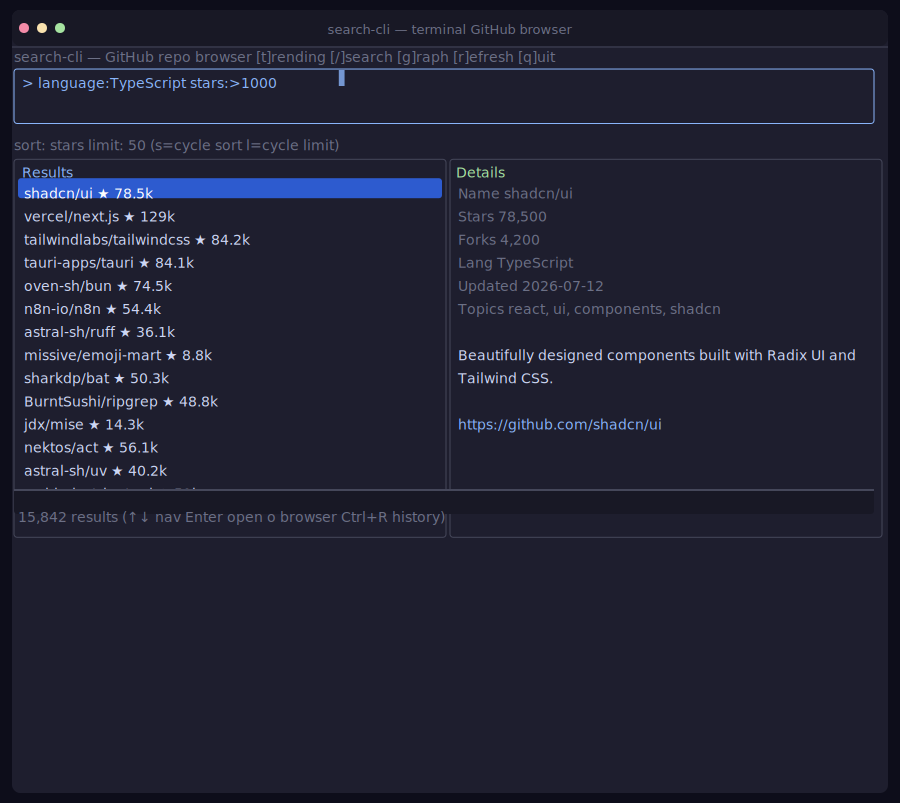

# search-cli

> Browse, search, and trend GitHub repos from your terminal. No browser needed.

<p align="center">
  
</p>

---

## Quick start

```bash
# Requires Bun (https://bun.sh)
npm install -g github-search-cli

# Launch the interactive TUI browser
search-cli

# Non-interactive search (pipe to jq, csvkit, etc.)
search-cli "language:Rust stars:>10000" --json | jq '.[].fullName'
search-cli "language:Zig" --count
search-cli --trending --json --since weekly
```

## CLI modes

```bash
search-cli "query" --json              # JSON array
search-cli "query" --csv               # CSV
search-cli "query" --markdown          # Markdown table
search-cli "query" --count             # Just the number
search-cli "query" --format urls       # One URL per line
search-cli "query" --pipe open         # Open each in browser
search-cli "query" --pipe clone        # Print clone commands
search-cli --trending --json           # Trending as JSON
search-cli --watch "query"             # Poll every 300s
```

### Shell completions

```bash
source <(search-cli --completion bash)   # Bash
source <(search-cli --completion zsh)    # Zsh
search-cli --completion fish | source    # Fish
```

### `gh` extension

```bash
gh extension install ./gh-search-cli
gh search-cli "language:Rust"
```

---

## Features

| Category | What you get |
|----------|-------------|
| **Search** | Free-text + qualifiers (`language:`, `stars:`, `topic:`), sort by stars/updated/forks, Tab auto-complete |
| **Trending** | Browse GitHub trending by day/week/month/year, filter by language |
| **Memory** | Persistent history (`Ctrl+R`), bookmarks (`b`/`B`), saved searches (`Ctrl+S`/`Ctrl+O`), session restore |
| **Deep-dive** | Per-repo detail: languages, top contributors, README preview (`d`) |
| **Compare** | Select 2+ repos and compare side-by-side (`c`/`C`) |
| **Explore** | Browse popular GitHub topics (`E`) |
| **Export** | JSON, CSV, Markdown, plain text (`Ctrl+E`) |
| **Shell** | Pipe-friendly output, `--watch` mode, shell completions, Docker |
| **Delight** | 3 themes (Tokyo Night, Dracula, Monokai), animated status bar, clipboard share, startup tips |

<details>
<summary><b>⌨️ Full keybindings</b></summary>

### Main view

| Key | Action |
|-----|--------|
| `/` | Focus search input |
| `Enter` | Execute search / open repo |
| `↑`/`↓` / `j`/`k` | Navigate results |
| `t` | Toggle search / trending |
| `s` | Cycle sort |
| `l` | Cycle limit |
| `r` | Refresh |
| `g` | Toggle activity graph |
| `d` | Toggle repo deep-dive |
| `o` | Open repo in browser |
| `b` / `B` | Toggle bookmark / open bookmarks |
| `c` / `C` | Toggle compare list / show comparison |
| `E` | Open topic explorer |
| `Tab` | Auto-complete qualifier |
| `?` / `Ctrl+H` | Help overlay |
| `q` | Quit |

### Overlays

| Key | Action |
|-----|--------|
| `Ctrl+R` | Search history |
| `Ctrl+S` | Save current search |
| `Ctrl+O` | Saved searches panel |
| `Ctrl+E` | Export results |
| `Ctrl+N` | Notifications |
| `Ctrl+P` | Share repo (copy to clipboard) |
| `PageDown` / `Ctrl+F` | Next page |
| `Esc` | Close overlay |

### Trending mode

| Key | Action |
|-----|--------|
| `1`–`5` | Switch tab (Today → Week → Month → Year → All) |
| `←`/`→` / `h`/`l` | Navigate tabs |
</details>

---

## Search syntax

```text
language:Rust stars:>1000 topic:cli
"machine learning" language:Python stars:>5000
topic:cli -language:JavaScript
org:rust-lang language:Rust
```

Supported qualifiers: `language:`, `stars:`, `fork:`, `archived:`, `topic:`, `user:`, `org:`, `repo:`, `updated:`, `pushed:`, `visibility:`, `license:`, `created:`, `size:`, `in:`. Prefix with `-` to exclude.

---

## Configuration

`~/.config/search-cli/config.json` (created automatically):

```json
{
  "defaultSort": "stars",
  "defaultLimit": 50,
  "theme": "tokyo-night",
  "githubToken": "ghp_..."
}
```

Or run `search-cli init` for the interactive setup wizard.

Environment variables: `GITHUB_TOKEN`, `SEARCH_CLI_CONFIG`, `XDG_CONFIG_HOME`, `XDG_STATE_HOME`.

---

## Install from source

```bash
git clone https://github.com/codersdfs/search-cli.git
cd search-cli
bun install
bun start              # Launch TUI
bun test               # 104 tests
bun run build          # Compile binary → dist/
```

---

## Design

```
CLI → QueryBuilder → Provider → Normalizer → Ranking → TUI / stdout
```

| Layer | File | Job |
|-------|------|-----|
| Entry | `src/cli.ts` | Arg parsing, routes to TUI or stdout |
| TUI | `src/tui.ts` | Interactive browser (OpenTUI) |
| Query | `src/query.ts` | Parse keywords/qualifiers |
| Provider | `src/provider.ts` | GitHub REST API with caching + token rotation |
| Types | `src/types.ts` | Shared interfaces |

The `SearchProvider` interface is the extension point for alternative backends (GitLab, local index, AI retriever).

---

## License

MIT
